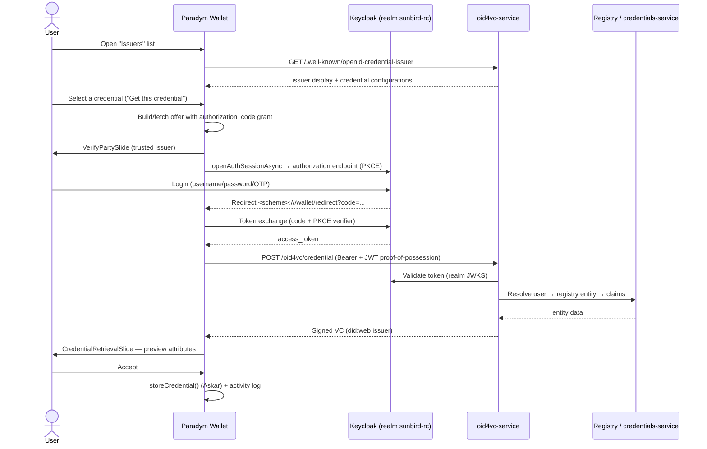

# Sunbird RC OID4VC × Paradym Wallet — Integration Analysis

**Date:** 2026-07-31
**Repos analyzed:**
- Wallet: `paradym-wallet` (this repo, branch `v1.0.3`)
- Server: `/Users/sanketikam4/July/sunbird-rc-core` (Sunbird RC core with the `services/oid4vc-service` layer)

**Target flow:**
1. The wallet shows a list of available issuers.
2. A real user logs in, the issuer validates the user via Keycloak, verifies their details, and returns the VC; the wallet shows the VC to the user, and on approval the user saves it into the wallet.

---

## 1. Executive summary

**Can we do this flow now? Not end-to-end — but roughly 70% of it already exists, and the largest gap is on the Sunbird side, not the wallet.**

| | Status |
|---|---|
| Wallet: receive an OID4VCI offer, preview the VC, approve, save | ✅ Fully built and generic |
| Wallet: browser-based login during issuance (Keycloak-compatible authorization_code flow with PKCE + DPoP) | ✅ Fully built |
| Wallet: browsable **issuer list** | ❌ Missing — everything starts from a QR scan or deeplink today |
| Sunbird: OID4VCI issuer (metadata, offer, token, credential endpoints; 4 credential formats) | ✅ Fully built (`services/oid4vc-service`) |
| Sunbird: **authorization_code grant / Keycloak login in issuance** | ❌ Missing — only `pre-authorized_code`; Keycloak is completely decoupled from OID4VC |
| Sunbird: derive credential claims from the **logged-in user** | ❌ Missing — claims are frozen into the offer by the issuer backend before the wallet ever connects |
| Issuer DID resolvable by the wallet | ⚠️ Default `did:rcw` is not publicly resolvable — must configure `did:web` |

**What works today with zero code changes:** the pre-authorized flow. An issuer backend (or the Java registry hooks) creates an offer via `POST /oid4vc/offer`, the user scans the QR in Paradym Wallet, previews the credential, and accepts — it is saved. But there is no user login and no issuer list; the claims are decided server-side before the offer is created.

**Estimated effort for the full target flow: ~2.5–3 weeks** (detail in §9).

---

## 2. Paradym Wallet — current architecture

The wallet is an Expo React Native app built on Credo (`@credo-ts/*` 0.6.3) with `@openid4vc/*` for OID4VCI/VP and Askar for secure storage. Feature code on this branch lives mostly under `apps/wallet/src/features/`, with shared code in `packages/app` and the SSI surface in `packages/sdk`.

### 2.1 Issuance entry points

- **QR scan:** `packages/app/src/features/scan/ScanScreen.tsx` → `packages/app/src/hooks/useCredentialDataHandler.tsx` → `parseInvitationUrl()` in `packages/sdk/src/invitation/parser.ts`. Recognized offer schemes: `openid-credential-offer://`, `openid-initiate-issuance://`, `haip-vci://`, and any URL containing `credential_offer=` / `credential_offer_uri=`.
- **Deeplink / cold start:** `apps/wallet/src/app/+native-intent.tsx` parses invitations synchronously and routes to the same screen. It also intercepts authorization-code redirect URLs (`/wallet/redirect?code=...`) and injects the code as a `credentialAuthorizationCode` router param — the mechanism that lets external browser/IdP redirects re-enter an in-flight issuance.

### 2.2 Offer resolution and the four flows

Route `apps/wallet/src/app/(app)/notifications/openIdCredential.tsx` renders `apps/wallet/src/features/receive/OpenIdCredentialNotificationScreen.tsx`, which calls the SDK's `resolveCredentialOffer()` (`packages/sdk/src/invitation/resolver.ts`, wrapping Credo's `agent.openid4vc.holder.resolveCredentialOffer`). The result is a discriminated union of four flows:

1. `pre-auth` — pre-authorized code, no user interaction with the issuer.
2. `pre-auth-with-tx-code` — pre-authorized + transaction code (PIN) entry (`TxCodeSlide`, 3 attempts).
3. `auth` — **authorization_code flow with a browser login** (the one Keycloak needs).
4. `auth-presentation-during-issuance` — the issuer requests an OID4VP presentation instead of a login.

### 2.3 The authorization_code (login) flow — already Keycloak-compatible

- `apps/wallet/src/features/receive/slides/AuthCodeFlowSlide.tsx` opens the issuer's authorization endpoint with **`WebBrowser.openAuthSessionAsync`** (ASWebAuthenticationSession on iOS / Custom Tabs on Android), then extracts `?code=` from the redirect.
- Token exchange with **PKCE and DPoP** in `packages/sdk/src/openid4vc/func/acquireAuthorizationCodeAccessToken.ts` (`agent.openid4vc.holder.requestToken({ code, redirectUri, clientId, codeVerifier, dpop })`).
- The wallet's OAuth client is `walletClient` in `apps/wallet/src/constants.ts`: `clientId` = the app scheme, `redirectUri` = `<scheme>:///wallet/redirect` (or the first allowed universal-link base URL).

Any standards-compliant OAuth authorization server — including Keycloak — works with this flow today, provided the wallet's redirect URI and client are registered on the AS.

### 2.4 Credential retrieval, preview, approval, storage

- All flows converge on `receiveCredentialFromOpenId4VciOffer()` (`packages/sdk/src/invitation/resolver.ts`), which calls Credo's `requestCredentials()` with an ES256/EdDSA proof-of-possession. Holder binding (did:jwk / did:key / raw jwk, hardware-backed keys for EUDI PID schemes) is decided in `packages/sdk/src/openid4vc/credentialBindingResolver.ts`.
- **Nothing is stored until the user approves.** The UI is a `SlideWizard`: `VerifyPartySlide` (issuer identity + trust state) → flow-specific slide (browser login / tx code) → `CredentialRetrievalSlide` (`apps/wallet/src/features/receive/slides/CredentialRetrievalSlide.tsx`), which shows the **actual received attributes** with accept/decline buttons.
- Accept → `completeCredentialRetrieval()` (`packages/sdk/src/openid4vc/func/completeCredentialRetrieval.ts`) → `storeCredential()` (`packages/sdk/src/storage/credentials.ts`) into the format-specific Credo/Askar repository, plus an activity-log entry and Digital Credentials API registration. Decline → nothing stored.

### 2.5 Supported formats

SD-JWT VC (`vc+sd-jwt`, `dc+sd-jwt`), mDoc (`mso_mdoc`), W3C VC 1.x (JWT and JSON-LD) and W3C VC 2.0. AnonCreds is available only over the DIDComm stack behind a feature flag — not over OID4VCI.

### 2.6 What the wallet does NOT have

**There is no browsable issuer directory.** The home screen (`apps/wallet/src/features/wallet/WalletScreen.tsx`) offers only "Scan QR-code" and "Present In-person". The only issuer-related registry is a *display-time* trust list hardcoded in `apps/wallet/src/constants.ts` (`trustedOpenId4VciIssuerEntities`, `trustedX509Entities`, `eudiTrustList`) used by `VerifyPartySlide` to show a "verified issuer" badge — it does not initiate issuance.

---

## 3. Sunbird RC — current OID4VC capabilities

Sunbird RC in this checkout includes a dedicated **NestJS OID4VC façade** at `services/oid4vc-service` (port 3400) implementing OID4VCI 1.0 (with a draft-13 compat mode) and OID4VP 1.0/draft-23. It holds no keys and no credentials — it delegates to:

- `services/credentials-service` — builds/signs/stores VCs (`/credentials/issue`, `/credentials/verify`).
- `services/identity-service` — DIDs and signing (`/utils/sign`, `/utils/sign-jwt`, `/utils/sign-sd-jwt`, `/utils/sign-mdoc`), keys in HashiCorp Vault, JWKS at `/.well-known/jwks.json`.
- `services/credential-schema` — schema CRUD; per-schema OID4VCI opt-in via `oid4vciConfig`.

### 3.1 Endpoints

| Endpoint | Notes |
|---|---|
| `GET /.well-known/openid-credential-issuer` | Issuer metadata; `credential_configurations_supported` built **live** from `GET /credential-schema/oid4vci-configs` (one configuration per schema × format) |
| `GET /.well-known/openid-configuration` | The façade advertises **itself** as the AS; `grant_types_supported: ['urn:ietf:params:oauth:grant-type:pre-authorized_code']` only |
| `POST /oid4vc/offer` | Backend-only offer creation: `{credential_configuration_id, format, claims}` → offer URI + QR deep link. **Claims are frozen here**, before the wallet connects. Unauthenticated (network-restricted by design) |
| `POST /oid4vc/token` | Exchanges the single-use pre-authorized code for a **façade-minted** 5-minute ES256 JWT (signed via identity-service with the issuer DID) |
| `POST /oid4vc/credential` | Bearer + JWT proof-of-possession (checks `aud`/nonce; holder key via `kid` DID or inline jwk) |
| `POST /oid4vc/nonce`, `/deferred`, `/notification` | Supporting OID4VCI endpoints |
| `/vp/*` | OID4VP verifier endpoints (request, request-object, direct_post response, status with 6 verification checks) |

The Java registry has fail-open hooks (`OID4VCIService.createOfferSafely()`) that fire offers automatically on entity create/update and claim grants, gated by `oid4vc.enabled` (default false).

### 3.2 Formats and signing

All four formats, selected per schema: `ldp_vc` (Ed25519Signature2020), `jwt_vc_json` (ES256), `vc+sd-jwt` (ES256, selective disclosure, `cnf` holder binding, SD-JWT VC Type Metadata at `/vct/:slug`), `mso_mdoc` (COSE_Sign1, P-256, self-signed X.509 — no IACA chain). Per-schema issuer DIDs (the schema author's DID) with fallback to a global `ISSUER_DID`.

### 3.3 Keycloak — present but decoupled from OID4VC

Keycloak (realm `sunbird-rc`) exists in the docker-compose stack, **but only as the Java registry's IdP** for its own REST APIs. The OID4VC flows never touch it:

- The token endpoint is the façade's own — it does not delegate to Keycloak.
- `authorization_code` is not implemented anywhere in `services/oid4vc-service` (grep confirms zero hits); other grant types return `400 unsupported_grant_type`.
- Consequently **there is no end-user authentication step in issuance today** — identity is established out-of-band by whoever calls `POST /oid4vc/offer`.

### 3.4 Interop status and caveats

- README claims interop testing with **Paradym Wallet for OID4VP (presentation) only** — OID4VCI issuance to Paradym is untested.
- Default issuer DID method is `did:rcw`, resolvable only against Sunbird's own database. **The Paradym wallet cannot resolve it**, so signature verification would fail; `did:web` is supported via `WEB_DID_BASE_URL` and must be used.

---

## 4. Gap analysis

| # | Requirement (from the goal) | Wallet | Sunbird | Gap owner |
|---|---|---|---|---|
| 1 | Show all issuers in an issuer list | ❌ No browse UI | ✅ Metadata + `oid4vci-configs` endpoints exist | **Wallet** (new UI feature) |
| 2 | User logs in; validation via Keycloak | ✅ authorization_code + PKCE + DPoP flow fully built | ❌ pre-authorized only; Keycloak decoupled | **Sunbird** (major) |
| 3 | Issuer verifies user's details → builds their VC | n/a | ❌ Claims frozen at offer time; no user→registry-entity resolution | **Sunbird** |
| 4 | Wallet shows VC; user approves; VC saved | ✅ `CredentialRetrievalSlide` → `storeCredential()` | ✅ credential endpoint | None |
| 5 | Wallet can verify the received credential | Needs a resolvable issuer DID | ⚠️ `did:rcw` default | **Sunbird config** (`did:web`) |
| 6 | Format compatibility | SD-JWT VC / mDoc / W3C VC | Same four formats | Testing only |

---

## 5. Changes required — Sunbird RC side (the major work)

### 5.1 Add the `authorization_code` grant, delegated to Keycloak

Recommended pattern: **external authorization server** (standard OID4VCI). Concretely:

1. Advertise Keycloak as the AS for the auth-code flow: add `authorization_servers: ["https://<host>/auth/realms/sunbird-rc"]` to the issuer metadata (`src/oid4vci/metadata.controller.ts`) and/or `authorization_endpoint` + `authorization_code` in `grant_types_supported` in the AS metadata (`src/oid4vci/token.service.ts`, `asMetadata()`).
2. The wallet then exchanges the authorization code **directly at Keycloak's token endpoint** (Credo handles this when the issuer metadata points at an external AS). The façade's `POST /oid4vc/credential` must accept and validate **Keycloak-issued access tokens** (verify against the realm JWKS, check `azp`/`aud` and the credential scope) in addition to its own pre-auth tokens.
3. Alternative (not recommended): the façade proxies the token exchange to Keycloak. More code, more state, no interop benefit.

### 5.2 Keycloak realm configuration

- Register the wallet as a **public client with PKCE required**: `client_id` = the wallet app scheme, redirect URI = `<wallet-scheme>:///wallet/redirect` (and/or the wallet's universal-link redirect base).
- Define one **client scope per credential configuration**, matching the `scope` values already emitted per configuration in the issuer metadata (currently the schema name), so the wallet requests the right scope during login.

### 5.3 Resolve claims from the authenticated user

Today the claims are frozen into the offer session at `POST /oid4vc/offer` time. For the auth-code flow, `POST /oid4vc/credential` must instead:

1. Extract the user identity from the validated Keycloak token (`sub` / `preferred_username` / `email`).
2. Look up the user's registry entity (Java registry search API or credentials-service) for the schema behind the requested `credential_configuration_id`.
3. Build the `credentialSubject` from that entity and issue via credentials-service, exactly as the pre-auth path does.

This is a new per-configuration **claims-resolver** component — the main design work on the Sunbird side (how Keycloak identities map to registry entities: shared `sub`, email match, or an explicit link field).

### 5.4 Wallet-initiated issuance (no pre-created offer)

Because the user starts from an issuer list rather than a scanned offer, either:
- add a lightweight `GET /oid4vc/offer-request?credential_configuration_id=...` returning a credential offer with an `authorization_code` grant and **no claims**, or
- rely on the wallet synthesizing the offer JSON client-side (§6.3) — in which case no new Sunbird endpoint is needed.

### 5.5 Issuer DID

Set `WEB_DID_BASE_URL` so the issuer signs with **`did:web`**; otherwise the wallet cannot resolve the issuer key and the credential shows as unverified/invalid.

### 5.6 Optional hardening

`/.well-known/oauth-authorization-server` alias; application-level auth on `POST /oid4vc/offer` (currently network-restricted only).

---

## 6. Changes required — Paradym Wallet side (moderate, mostly UI)

### 6.1 New feature: `apps/wallet/src/features/issuers/`

- `IssuerListScreen`: reads a configured list of issuer base URLs (a constant in `apps/wallet/src/constants.ts`, same pattern as `trustedOpenId4VciIssuerEntities`), fetches each issuer's `/.well-known/openid-credential-issuer`, and renders the issuer display (name/logo from metadata `display`) with its `credential_configurations_supported` (each configuration's display name, description, format).
- Entry point: a new action on `WalletScreen.tsx` next to "Scan QR-code".

### 6.2 "Get this credential" action — reuse the entire existing pipeline

Selecting a credential pushes to the **existing** route: `/notifications/openIdCredential?uri=<offer-uri>`. From there everything already works unchanged: `resolveCredentialOffer()` detects the `auth` flow → `VerifyPartySlide` → `AuthCodeFlowSlide` opens Keycloak in the in-app browser → PKCE token exchange → credential request → `CredentialRetrievalSlide` preview → accept → `storeCredential()`. **No changes to the issuance pipeline itself.**

### 6.3 Offer construction

If Sunbird adds the offer-request endpoint (§5.4), fetch it. Otherwise synthesize the offer locally:

```
openid-credential-offer://?credential_offer=<urlencoded JSON>

{
  "credential_issuer": "https://<sunbird-host>",
  "credential_configuration_ids": ["<schemaId or schemaId_format>"],
  "grants": { "authorization_code": {} }
}
```

Credo resolves such an offer like any scanned one.

### 6.4 Trust display

Add the Sunbird issuer to `trustedOpenId4VciIssuerEntities` in `apps/wallet/src/constants.ts` so `VerifyPartySlide` shows it as a verified/trusted issuer instead of "unknown".

---

## 7. Target end-to-end flow



---

## 8. What can be demonstrated today (zero code changes)

The **pre-authorized flow** works now, subject to `did:web` configuration:

1. Publish a schema with `oid4vciConfig` in credential-schema; set `WEB_DID_BASE_URL`.
2. Issuer backend calls `POST /oid4vc/offer` with the user's claims → QR.
3. User scans the QR with the Paradym Wallet dev build → previews → accepts → saved.

Limitations: no user login (identity established out-of-band by the backend), no issuer list. **Recommended as the immediate de-risking milestone** — it validates format interop, DID resolution, and proof-of-possession between the two stacks before any auth-code work begins.

---

## 9. Effort estimate

| Work item | Owner | Estimate |
|---|---|---|
| `authorization_code` grant + Keycloak token validation + realm config | Sunbird | 1–1.5 weeks |
| User→registry-entity claims resolver | Sunbird | 2–4 days (design-dependent: identity mapping) |
| `did:web` issuer configuration | Sunbird | < 1 day (config) |
| Issuer-list feature (screen + offer wiring + trust entry) | Wallet | 3–5 days |
| Interop testing (formats, DID resolution, device redirect URIs) | Both | 2–3 days |
| **Total** | | **~2.5–3 weeks** |

---

## 10. Key file reference

**Wallet (`paradym-wallet`):**
- `apps/wallet/src/features/receive/OpenIdCredentialNotificationScreen.tsx` — issuance wizard
- `apps/wallet/src/features/receive/slides/AuthCodeFlowSlide.tsx` — browser login slide
- `apps/wallet/src/features/receive/slides/CredentialRetrievalSlide.tsx` — approval screen
- `packages/sdk/src/invitation/resolver.ts` — offer resolution + credential retrieval
- `packages/sdk/src/openid4vc/func/acquireCredentials*.ts` — per-flow token/credential acquisition
- `packages/sdk/src/storage/credentials.ts` — storage on accept
- `apps/wallet/src/constants.ts` — wallet OAuth client, trusted-issuer lists (add Sunbird here)
- `apps/wallet/src/features/wallet/WalletScreen.tsx` — home screen (add issuer-list entry)
- *(new)* `apps/wallet/src/features/issuers/` — issuer list feature

**Sunbird RC (`sunbird-rc-core`):**
- `services/oid4vc-service/src/oid4vci/metadata.controller.ts` — issuer/AS metadata (add `authorization_servers`)
- `services/oid4vc-service/src/oid4vci/token.service.ts` — AS metadata + token minting (Keycloak validation)
- `services/oid4vc-service/src/oid4vci/oid4vci.controller.ts` — offer/token/credential endpoints (claims resolver hook)
- `services/credential-schema` — `oid4vciConfig` per schema (feeds the issuer list)
- `imports/realm-export.json` — Keycloak realm (wallet client + scopes)
- `services/oid4vc-service/README.md` — the service's own extensive documentation
